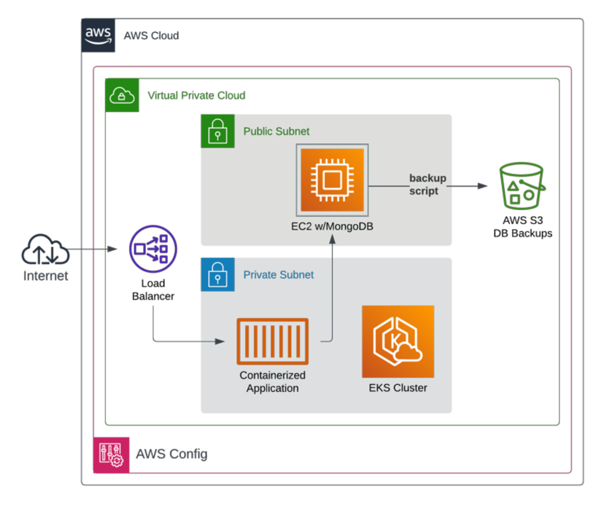

# three tier app demo

This repository deploys a simple three-tiered web application into AWS.



## how to deploy
- to deploy the stack, run the Actions workflows or use: [`deploy.sh`](./deploy.sh)
- to destroy the stack, run the Actions workflows or use [`destroy.sh`](./destroy.sh)

### prerequisites for local runs
- docker running locally
- terraform cli installed
- AWS credentials loaded in environment
- AWS role created for terraforming

### prerequisites for github actions runs
- self-hosted actions runner
- terraform cloud api token
- AWS role created for terraforming

### how to verify data in database:
```
docker exec -it CID mongo
use admin
db.auth("username", "password");
show dbs
use go-mongodb
show collections
db.todos.find()
db.user.find()
```

## high level flow

### docker
    a. create a container repository
    b. publish docker image to the registry

### terraform
    a. set tfvars
    b. terraform apply
    c. configure kubectl

### kubernetes
    a. apply yaml
